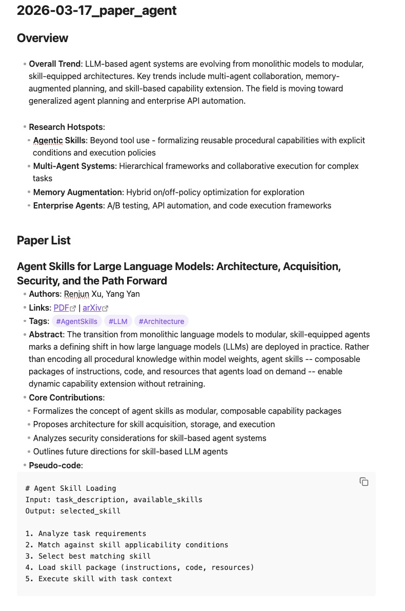
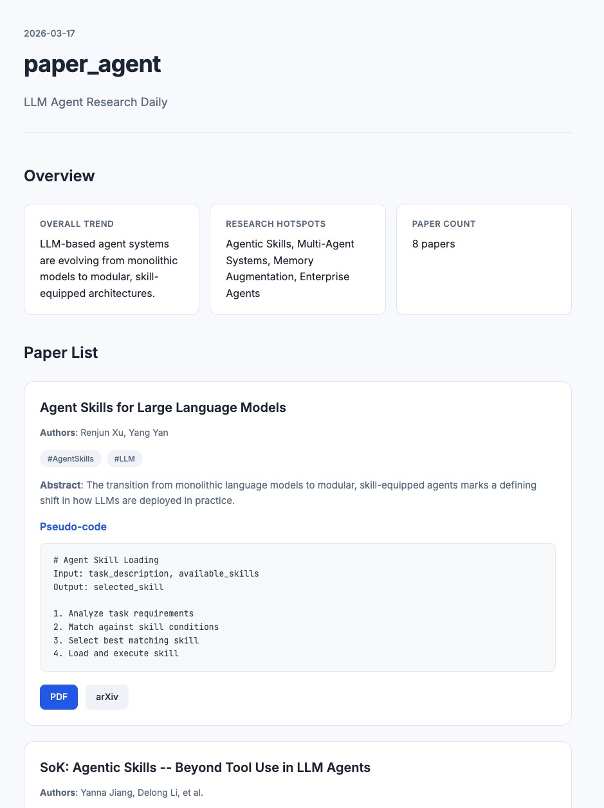
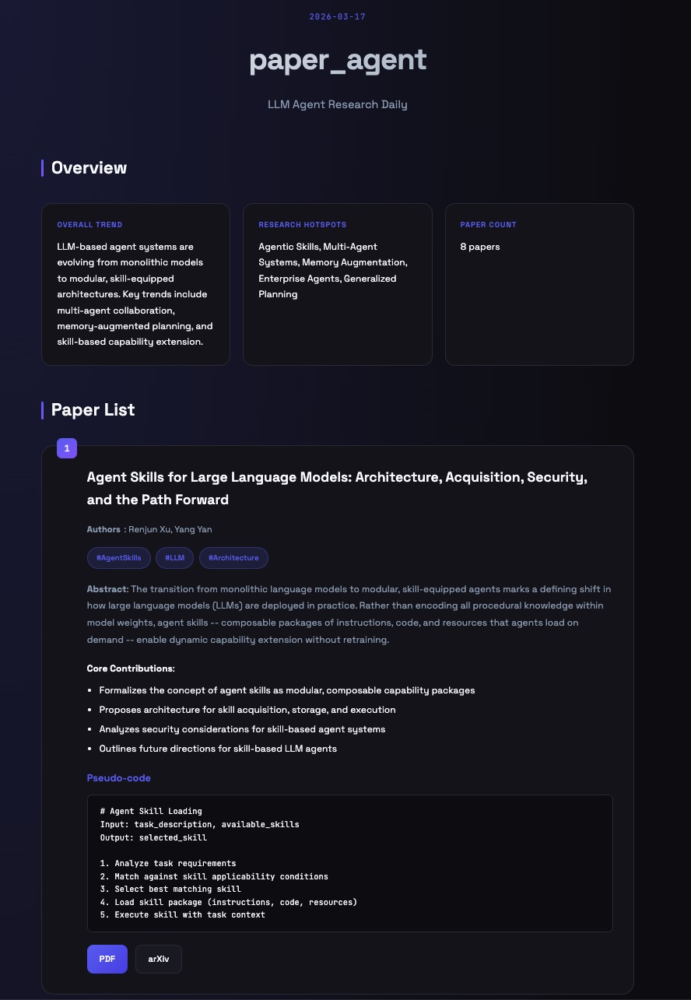
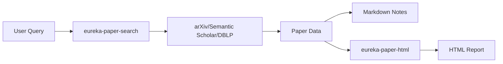

# EURAKA

[English](./README.md) | [中文](./README_cn.md)


> Academic paper research workflow tools

## Preview

| Format | Preview |
|--------|---------|
| **Markdown** |  |
| **HTML Minimal** |  |
| **HTML Cyberpunk** |  |

## SKILLS

| Skill | Description |
|-------|-------------|
| **eureka-paper-search** | Multi-source academic paper search with automatic fallback |
| **eureka-paper-html** | Generate HTML reports from paper data |

### eureka-paper-search

Multi-source academic paper search tool with automatic fallback.

- **Features**:
  - Search from arXiv, Semantic Scholar, DBLP
  - Automatic fallback mechanism
  - Configurable research interests
  - Generates structured notes (Obsidian/Markdown)
  - Optional image extraction & pseudo-code generation

- **Usage**:
  ```
  /eureka-paper-search llm_agent
  /eureka-paper-search memory_skills
  /eureka-paper-search 2026-03-17 reasoning
  ```

### eureka-paper-html

Generate beautiful HTML reports from paper data.

- **Features**:
  - Two design templates: Minimal (white) & Cyberpunk (dark)
  - Responsive layout
  - Animation effects (Cyberpunk style)
  - Accessibility optimized

- **Templates**:
  - `minimal.html` - Clean Swiss Style
  - `cyberpunk.html` - Dark mode with gradient & animations

- **Usage**:
  ```
  /eureka-paper-html --input results.json --output report.html
  /eureka-paper-html --topic llm_agent --date 2026-03-17
  ```

## How It Works



## Installation

### Claude Code

```bash
cp -r skills/eureka-paper-search ~/.claude/skills/
cp -r skills/eureka-paper-html ~/.claude/skills/
```

### OpenCLAW

```bash
mkdir -p ~/.openclaw/skills
cp -r skills/eureka-paper-search ~/.openclaw/skills/
cp -r skills/eureka-paper-html ~/.openclaw/skills/
```

### Cursor / VS Code

Copy skills folder to your workspace or use the extension's skill import feature.

### Codex

```bash
cp -r skills/eureka-paper-search ~/.codex/skills/
cp -r skills/eureka-paper-html ~/.codex/skills/
```

## Configuration

Create and edit `~/.eureka/preference.md` to configure:

- **Research interests**: keywords, topics, priority
- **Output targets**: Obsidian vault path, directory
- **Data sources**: arXiv, Semantic Scholar, DBLP preferences
- **Features**: image extraction, pseudo-code generation

## Design System

eureka-paper-html provides two templates in `references/templates/`:

| Template | Description |
|----------|-------------|
| **minimal** | Clean white background, Swiss Style |
| **cyberpunk** | Dark mode with gradient effects & animations |

Both templates generate reports with:
- Overview: Overall Trend, Research Hotspots
- Paper List: Authors, Links, Tags, Abstract, Core Contributions

**Default**: minimal style

## License

MIT
